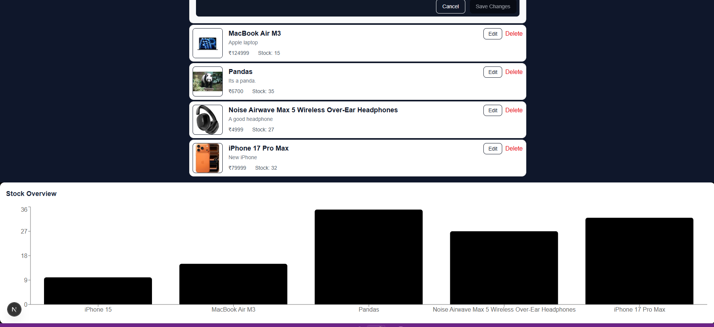
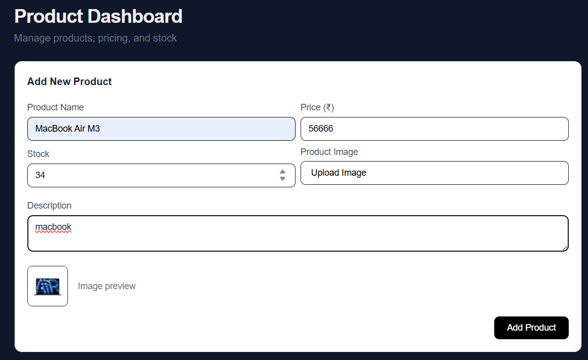
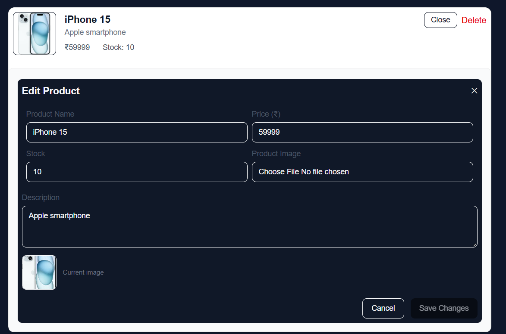

# SSR E-commerce Product Management Dashboard


## Project Overview

This project is a **server-side rendered (SSR) admin dashboard** for managing products in an e-commerce system.  
It allows administrators to **create, read, update, and delete products**, manage stock, and visualize product metrics via interactive charts. The application leverages **Next.js SSR**, **Prisma ORM**, and **AWS S3** for secure image uploads.  

The SSR approach ensures **fast page load times**, **better SEO**, and improved performance compared to client-rendered dashboards.

---

## Key Features

- **Server-Side Rendering** with Next.js for fast loading and SEO  
- **Product Management (CRUD)**: Add, Edit, Delete products with image support  
- **Secure Image Upload** to AWS S3  
- **Dynamic Product Charts** showing stock levels and metrics  
- **Form Validation** using Zod  
- **Instant UI Updates** without refreshing the page  
- **Responsive Layout** for mobile and desktop  

---

## Tech Stack

| Layer                 | Technology                                  |
|-----------------------|---------------------------------------------|
| Frontend & Backend    | Next.js (App Router, SSR)                  |
| Database              | PostgreSQL (Neon DB)                        |
| ORM                   | Prisma                                      |
| Form Validation       | Zod                                         |
| Image Storage         | AWS S3                                      |
| Data Visualization    | Recharts                                    |
| Deployment            | Vercel                                      |

---

## Screenshots

<!-- Replace with your own screenshots -->




---

## Getting Started (Local Development)

### Prerequisites

- Node.js >= 18
- npm >= 8
- PostgreSQL / Neon DB account
- AWS S3 bucket for image storage

### Setup

1. **Clone the repository**
```bash
git clone https://github.com/your-username/E-Commerce_DashBoard.git
cd E-Commerce_DashBoard
```

2. **Install Dependencies**
```bash
npm install
```

3. **Configure environment variables**
Create a .env file in the root directory:
```bash
DATABASE_URL="postgresql://<username>:<password>@<host>:<port>/<dbname>?schema=public"
AWS_ACCESS_KEY_ID="your_aws_access_key"
AWS_SECRET_ACCESS_KEY="your_aws_secret_key"
AWS_BUCKET_NAME="your_bucket_name"
```
4. **Push prisma Schema to database**
```bash
npx prisma db push
```

5. **Run the development server**
```bash
npm run dev
```
Open http://localhost:3000/dashboard to see the dashboard.


## Deployment (Vercel + Neon + AWS S3)

1. Push your code to GitHub.
2. Connect the repository to Vercel
3. Add the environment variables in Vercel dashboard:
        DATABASE_URL → Neon DB URL
        AWS_ACCESS_KEY_ID
        AWS_SECRET_ACCESS_KEY
        AWS_BUCKET_NAME
4. Deploy and visit the production URL.

## Folder structure
├── app              
│   ├── dashboard
│   │   ├── DashboardUI.tsx
│   │   ├── ProductChart.tsx
│   │   ├── AddProductForm.tsx
│   │   └── EditProductForm.tsx
├── lib
│   ├── prisma.ts
│   ├── s3.ts
│   └── validators
│       └── product.ts
├── prisma
│   └── schema.prisma
├── pages/api
│   └── upload.ts
├── public
├── .env
└── package.json

## Usage

1. Add Product: Fill out the form, upload an image, and submit.
2. Edit Product: Click edit on any product row, update fields or image, save changes.
3. Delete Product: Click delete on a product row to remove it.
4. View Charts: The dashboard charts dynamically reflect stock levels.

## Demo Video
https://drive.google.com/file/d/1EXPgNin1RIBsHQZhY6GXFmO1lLdOLclH/view?usp=drive_link
